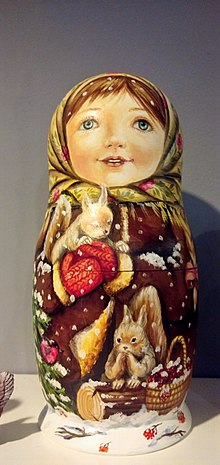

# T0ta1_R3doll.jpg:
## 3-10-24
## Question Statement:

just the two images.

doll.jpg
---

---
mat_doll.jpg
---


---

## Approach:

The two images are of matryoshka dolls, a type of russian doll, famous for encasing another.
The two images, when looked through by binwalk

```
binwalk doll.jpg

binwalk mat_doll.jpg

```
will return a zip file type from the doll.jpg which they can extract using

```
binwalk -e dolls.jpg
```

this will give them an extracted file wher they will find an image that is the same as the one before, just named dolls2.jpg
They will have to continue this extraction and opening untill they reach dolls4.jpg where when they extract, they will find nothing.

This is where the image of the 5 dolls comes into play, it is to signify that there are 5 images as well
Checking for hidden images/files using

```
ls -a 
```
should give them the image of the 5th doll, which does not have any zip files inside it.

When they run it through the common binwalk procedures, they will that the comment says:

```
wtfCTF{ThEr3_r_5}

```
that is the flag.
