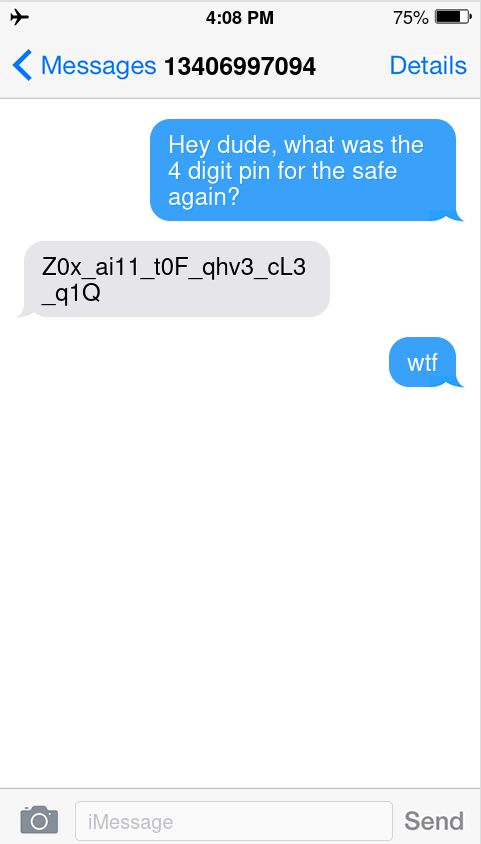

# P1nN3D_M3s54g3
## 10/10/24

## Question statement:

You seem to have forgotten the pin to the safe in your room. You ask your roommate, but them being too cautious by always using burner phones and whatnot, they send a weird message instead.  
This is your conversation:

 
Open the safe using the pin.

---

## Approach

The message sent is `Z0x_ai11_t0F_qhv3_cL3_q1Q`.  
This is encrypted via the Gronsfield cipher using the sender's number, which is: `13406997094`.  
Decrypting this using the cipher gives us `Y0u_wi11_n0W_hav3_tH3_p1N`,  
which indicates that the pin has been translated to the message itself.  

The burner phone info dump will indicate that the sender uses a phone with a numpad.  
The pin is the sum of all the multitap codes for the letters of the decrypted message.  

The multitap code comes to: `999 88 9 444 66 9 44 2 888 8 44 7 66`.  
Adding all of these gives us: `2674`,  
which is the pin that will be used in the flag.
